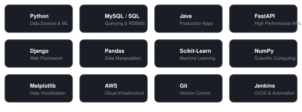

<h1 align="center">Hi  I'm Vedant Modi</h1>

  <b>Data Analyst &amp; Machine Learning Engineer</b> 
  <i>Specializing in Healthcare Analytics, ML Pipelines, &amp; Interactive Dashboards</i>

  
  
  

---

### 💼 Career Highlights & Impact

<table align="center" width="100%">
  <tr>
    <td width="50%">
      <b>🚀 2.5+ Years at AGS Health</b> 
      Developing production ML pipelines and data analytics solutions for complex medical datasets.
    </td>
    <td width="50%">
      <b>📈 F1 Accuracy: 77% ➔ 84%</b> 
      Optimized classification and text segmentation models, raising accuracy up to 89% for key segments.
    </td>
  </tr>
  <tr>
    <td width="50%">
      <b>📉 77% Storage Cost Reduction</b> 
      Migrated 130GB raw files to optimized columnar Apache Parquet formats, reducing S3 usage to 30GB.
    </td>
    <td width="50%">
      <b>⚙️ Workflow Automation</b> 
      Built self-service team dashboards (Plotly + FastAPI) and automated ETL processing with Prefect.
    </td>
  </tr>
</table>

---

### 🧑‍💻 About Me

- 🔭 I’m currently working as a **Data Analyst & ML Engineer** at **AGS Health Pvt. Ltd.**, building scalable machine learning classifiers and feature engineering frameworks.
- 🧪 I specialize in **healthcare analytics**, cleaning complex medical billing/clinical notes and integrating classification engines into Java-based production pipelines.
- ⚙️ I love automation — from writing **Prefect pipelines** and deploying model retraining workflows to implementing model drift detection.
- 🎓 I graduated with a **Bachelor of Engineering in Information Technology** from **L.D. College of Engineering (LDCE)**.
- 💬 Ask me about: **Gradient Boosting, Feature Engineering, SQL Caching, FastAPI, and NLP.**

---

### 🛠️ Technical Skills

  <i>Hover over the cards to interact!</i>

  

---

### 📊 GitHub Stats

  
  &nbsp;&nbsp;&nbsp;&nbsp;
  

  

---

  📫 <b>Let's Connect!</b> Reach out via <a href="mailto:2001vedant@gmail.com">Email</a> or <a href="https://www.linkedin.com/in/vedant-modi-3744ab213">LinkedIn</a>.

